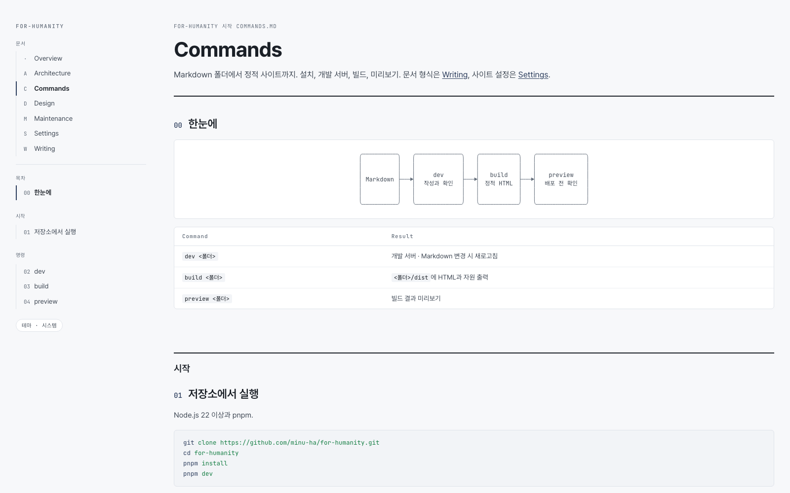

<div align="center">


# for-humanity

**사람이 읽는 문서를 위한 Markdown 킷**

문서 폴더 하나. 사이드바, 절 번호, 흐름도까지.

[](LICENSE)


[시작하기](templates/document/commands.md) · [문서 작성](templates/document/writing.md) · [설정](templates/document/settings.md) · [기여](templates/document/maintenance.md)

<br>

<picture>
    <source media="(prefers-color-scheme: dark)" srcset=".github/readme/commands-dark.png">
    
</picture>

</div>

## Quick Start

```sh
pnpm install
pnpm dev
```

[localhost:4321](http://localhost:4321)에서 프로젝트 문서 열기.

## Features

- **읽는 흐름** — 문서 목록, 가름별 목차, 자동 절 번호, 현재 위치 표시
- **Markdown 그대로** — 코드 강조, 흐름도, 상태 표지, 색 칩
- **가벼운 결과물** — 정적 HTML, 작은 브라우저 스크립트, 자체 호스팅 글꼴
- **세 가지 테마** — 시스템, 밝게, 어둡게

## Documentation

사용법과 프로젝트 문서: [templates/document](templates/document).

## License

[MIT](LICENSE) © 2026 하민우
