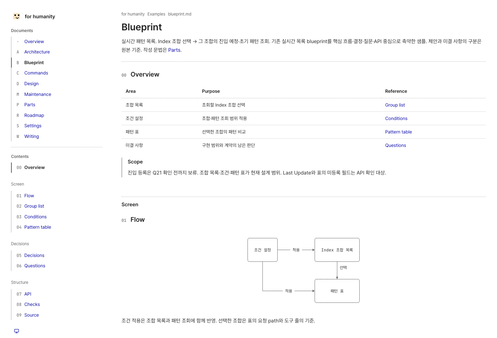

<div align="center">


# for humanity

**사람이 읽는 문서를 위한 Markdown 문서 도구**

Markdown으로 작성하고, 맥락을 남기고, 정적 사이트로 공유.

[](../LICENSE)


[Quick start](#quick-start) · [Writing](../templates/document/writing.md) · [Parts](../templates/document/parts.md) · [Roadmap](../templates/document/roadmap.md) · [English](../README.md)

<br>

<picture>
    <source media="(prefers-color-scheme: dark)" srcset="../.github/readme/blueprint-dark.png">
    
</picture>

</div>

## A little structure. Room to read.

- **Navigation** — 문서 목록·part별 TOC·자동 section 번호·현재 읽는 위치
- **Context** — 보충 설명은 Note, 구현 상세는 Details. 접힌 section도 링크로 바로 이동
- **Content** — 표·코드 강조·Mermaid·status badge·color swatch
- **Static output** — 정적 HTML·자체 호스팅 폰트·작은 브라우저 스크립트. React hydration 없음
- **Reading** — System·Light·Dark, 키보드 이동, 좁은 화면의 배치

## Quick start

Node.js 22 이상과 pnpm. 현재는 소스 저장소에서 실행.

```sh
git clone https://github.com/minu-ha/for-humanity.git
cd for-humanity
pnpm install
pnpm dev
```

[localhost:4321](http://localhost:4321)에서 프로젝트 문서와 샘플 확인.

```sh
pnpm build      # templates/document/dist 생성
pnpm preview    # 정적 사이트 미리보기
```

현재는 prototype. `init`과 첫 npm 공개는 [Roadmap](../templates/document/roadmap.md)의 예정 작업.

## Make it yours

문서 폴더로 시작. 사이트 설정을 생략하면 사이드바에 픽셀 얼굴과 **for humanity**.
`for-humanity.config.mjs`의 `title`로 자신의 사이트 이름 지정.

```js
export default {
    title: "Project notes",
    description: "결정·작업 기록·구현의 근거를 담는 문서.",
};
```

다른 문서 폴더의 실행은 [Commands](../templates/document/commands.md), 설정은 [Settings](../templates/document/settings.md).

## Write with context

```markdown
:::note[Scope]
문서의 범위와 아직 결정이 필요한 내용.
:::

:::details[Implementation]
화면 뒤의 계약·코드·판단 근거.
:::
```

[Parts](../templates/document/parts.md)에 소스와 실제 결과.
[Blueprint sample](../templates/document/blueprint.md)에 화면 흐름·결정·미결 질문·API 계약.

## Documentation

[Writing](../templates/document/writing.md) · [Parts](../templates/document/parts.md) · [Settings](../templates/document/settings.md) · [Architecture](../templates/document/architecture.md) · [Contributing](../templates/document/maintenance.md)

## License

[MIT](../LICENSE) © 2026 [minu-ha](https://github.com/minu-ha)
