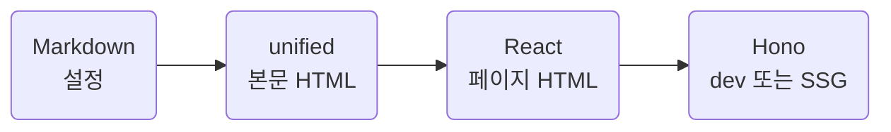

라이브러리 내부 구현을 수정하는 사람을 위한 참고 문서.
Hono 라우팅과 정적 출력, React 서버 렌더링, unified Markdown processor.
브라우저 동작은 작은 DOM 스크립트 하나.

## Overview

| Entry       | Responsibility                               | Runtime       |
| ----------- | -------------------------------------------- | ------------- |
| `cli.ts`    | 인자 · 설정 · 문서 · 폰트 · 빌드·서버 시작   | Node.js       |
| `app.tsx`   | 첫 화면과 문서 라우트 · React → HTML         | Node.js       |
| `dev.ts`    | 자원 · SSE 새로고침 · 페이지 앱 위임         | Node.js · dev |
| `client.ts` | 커서 장식 · 읽는 section · 접힌 hash 보정 | Browser      |

::part[Engine]

## Routing and rendering

페이지 앱의 라우트: `/`, `/:slug{.+}/`. 문서 id에는 하위 폴더 포함.
`/`는 문서 폴더의 `README.md`. 일반 문서 목록과 별도로 읽고, 개발 중 함께 갱신.

- React: `renderToStaticMarkup`으로 HTML 문서 생성
- build: Hono `ssgParams`와 `toSSG`로 같은 라우트 출력
- dev: `@hono/node-server`로 같은 페이지 앱 제공
- preview: `serveStatic`으로 빌드 결과 제공

페이지 앱과 dev 앱의 분리는 SSG 대상과 개발 전용 자원의 경계.
Hono 정규식 매개변수와 wildcard 라우트 혼합 시 Router 제약도 이 경계에서 격리.

### Design choices

문서 사이트에는 hydration과 React 브라우저 번들 불필요.
서버 TSX는 페이지 조립, DOM 스크립트는 작은 상호작용 담당.
`@hono/react-renderer`는 렌더링 middleware가 필요할 때의 선택지.
현재 공통 HTML 틀은 `WgShell` 소유 · 직접 React 렌더링 유지.

참조: [Hono SSG](https://hono.dev/docs/helpers/ssg), [Node.js Adapter](https://hono.dev/docs/getting-started/nodejs), [React static rendering](https://react.dev/reference/react-dom/server/renderToStaticMarkup).

## Navigation lifecycle

문서 링크는 전체 HTML 페이지를 이동합니다. React 브라우저 hydration과 전역 클라이언트 스토어는 사용하지 않습니다.
문서 목록과 On this page는 같은 사이드바의 위·아래에 배치하지만 스크롤 컨테이너는 별도입니다. 공통 목록의 높이는 페이지별 목차 길이와 무관합니다.

탐색 HTML 바로 뒤의 작은 동기 스크립트가 첫 paint 전에 데스크톱 위치와 넘침 흐림을 적용합니다. 큰 본문이나 외부 client module 다운로드를 기다리지 않습니다.
`restoreNavigationScroll`과 `bindNavigationOverflow`는 이 조기 실행을 위해 외부 변수 없이 직렬화 가능한 함수로 유지합니다.
클라이언트는 이후 위치 저장과 드로어·반응형 전환을 연결하고, 이미 제자리에 있는 탐색 DOM을 다시 삽입하지 않습니다.

문서 목록은 같은 탭의 `sessionStorage`에 데스크톱·드로어 위치를 나누어 저장합니다. 문서 링크 순서가 달라지면 이전 위치는 무효입니다.
목차 위치는 같은 페이지를 새로고침할 때만 복원하고 다른 문서의 목차는 시작점에서 읽습니다. 저장소가 차단되거나 값이 손상돼도 기본 탐색은 유지합니다.
`ResizeObserver`와 스크롤 이벤트는 실제 위·아래 넘침이 있는 끝만 흐리게 합니다. 강제 색상과 JavaScript 미사용 환경은 네이티브 손잡이를 사용합니다.

## Markdown pipeline

| Stage  | Work                                                                 |
| ------ | -------------------------------------------------------------------- |
| Read   | 파일 탐색 · remark-frontmatter의 YAML 노드 · yaml 값 해석 · Zod 검증 |
| remark | GFM · 문장부호 · Note·Details · part · 흐름도 · status badge · swatch · 링크 · 경고 |
| rehype | 코드 강조 · 문서 header · 제목 id · 가름 수집 · 표 상자           |
| Output | raw HTML 해석 · HTML 문자열                                          |

제목 원문에서 id와 TOC 텍스트를 수집하고 가름별로 묶음. 제목 번호는 자동 생성하지 않음.
중간 계약은 `file.data.fh`. 제목과 section 정보는 문서 순서 유지.
frontmatter는 정규식으로 잘라내지 않고 AST 노드로 읽음. 본문 노드의 원본 줄·열은 유지.
Note·Details의 검증은 Markdown 부품 변환 전. 제목은 native label, 본문은 기존 처리 흐름.
접힌 본문의 `###`도 같은 제목 id·TOC. 부품의 작성 계약은 [Parts](parts.md).

remark는 Markdown을 AST로 다루는 플러그인 체계. 현재의 부품 변환·검증과 rehype 연결에 사용.
markdown-it도 확장 가능한 렌더러이며 VitePress에서 사용. 한쪽이 항상 더 좋은 것은 아니고, 이 프로젝트는 기존 AST 변환을 유지.
gray-matter는 frontmatter를 분리·해석하는 다른 선택지. 여기서는 `remark-frontmatter`와 기존 `yaml`을 조합.

참조: [remark](https://github.com/remarkjs/remark), [remark-frontmatter](https://github.com/remarkjs/remark-frontmatter), [gray-matter](https://github.com/jonschlinkert/gray-matter), [VitePress Markdown](https://vitepress.dev/ko/guide/markdown).

::part[Ownership]

## Code ownership

| Concern                       | Owner                        |
| ----------------------------- | ---------------------------- |
| 첫 화면 · 문서 페이지         | `src/page`                   |
| HTML 틀 · 사이드바            | `src/component/widget/shell` |
| 본문 · remark·rehype 플러그인 | `src/component/widget/prose` |
| processor · 문서 읽기         | `src/content`                |
| 상수 · 문구 · 스키마          | `src/constant` · `src/type`  |
| 색 · 폰트 · 간격              | `src/style/token.css`        |
| 격자 렌더러 · 폰트 변환       | `src/util`                   |

## Package output

`build:kit`: esbuild로 서버 CLI와 CSS, 브라우저 스크립트 생성.
폰트와 favicon 원본은 패키지에 포함, 사이트 빌드 시 결과 폴더로 복사.

- `dist/cli.js`: npm bin 진입점
- `dist/cli.css`: 컴포넌트 CSS 묶음
- `dist/client.js`: 브라우저 스크립트
- 자원 URL: `/_fh/` · favicon: `/favicon.svg`

패키지 빌드와 문서 사이트 빌드는 별도 단계. 절차는 [Maintenance](maintenance.md).
