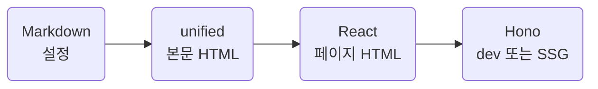

Hono 라우팅과 정적 출력, React 서버 렌더링, unified Markdown processor.
브라우저 동작은 작은 DOM 스크립트 하나.

## Overview

| Entry       | Responsibility                               | Runtime       |
| ----------- | -------------------------------------------- | ------------- |
| `cli.ts`    | 인자 · 설정 · 문서 · 폰트 · 빌드·서버 시작   | Node.js       |
| `app.tsx`   | 첫 화면과 문서 라우트 · React → HTML         | Node.js       |
| `dev.ts`    | 자원 · SSE 새로고침 · 페이지 앱 위임         | Node.js · dev |
| `client.ts` | 테마 · 현재 section · 폰트 로드 후 hash 보정 | Browser       |

::part[Engine]

## Routing and rendering

페이지 앱의 라우트: `/`, `/:slug{.+}/`. 문서 id에는 하위 폴더 포함.

- React: `renderToStaticMarkup`으로 HTML 문서 생성
- build: Hono `ssgParams`와 `toSSG`로 같은 라우트 출력
- dev: `@hono/node-server`로 같은 페이지 앱 제공
- preview: `serveStatic`으로 빌드 결과 제공

페이지 앱과 dev 앱의 분리는 SSG 대상과 개발 전용 자원의 경계.
Hono 정규식 매개변수와 wildcard 라우트 혼합 시 Router 제약도 이 경계에서 격리.

### Design choices

문서 사이트에는 hydration과 React 브라우저 번들 불필요.
서버 TSX는 페이지 조립, DOM 스크립트는 작은 상호작용 담당.
`@hono/react-renderer`는 렌더링 middleware가 필요할 때의 선택지.
현재 공통 HTML 틀은 `WgShell` 소유 · 직접 React 렌더링 유지.

참조: [Hono SSG](https://hono.dev/docs/helpers/ssg), [Node.js Adapter](https://hono.dev/docs/getting-started/nodejs), [React static rendering](https://react.dev/reference/react-dom/server/renderToStaticMarkup).

## Markdown pipeline

| Stage  | Work                                                                 |
| ------ | -------------------------------------------------------------------- |
| Read   | 파일 탐색 · YAML frontmatter · Zod 검증                              |
| remark | GFM · 문장부호 · part · 흐름도 · status badge · swatch · 링크 · 경고 |
| rehype | 코드 강조 · 문서 header · 제목 id · section 번호 · 표 상자           |
| Output | raw HTML 해석 · HTML 문자열                                          |

제목 id 생성은 section 번호 삽입보다 먼저. 링크와 TOC 텍스트의 번호 혼입 방지.
중간 계약은 `file.data.fh`. 제목과 section 정보는 문서 순서 유지.

::part[Ownership]

## Code ownership

| Concern                       | Owner                        |
| ----------------------------- | ---------------------------- |
| 첫 화면 · 문서 페이지         | `src/page`                   |
| HTML 틀 · 사이드바            | `src/component/widget/shell` |
| 본문 · remark·rehype 플러그인 | `src/component/widget/prose` |
| processor · 문서 읽기         | `src/content`                |
| 상수 · 문구 · 스키마          | `src/constant` · `src/type`  |
| 색 · 폰트 · 간격              | `src/style/token.css`        |
| 격자 렌더러 · 폰트 변환       | `src/util`                   |

## Package output

`build:kit`: esbuild로 서버 CLI와 CSS, 브라우저 스크립트 생성.
폰트와 favicon 원본은 패키지에 포함, 사이트 빌드 시 결과 폴더로 복사.

- `dist/cli.js`: npm bin 진입점
- `dist/cli.css`: 컴포넌트 CSS 묶음
- `dist/client.js`: 브라우저 스크립트
- 자원 URL: `/_fh/` · favicon: `/favicon.svg`

패키지 빌드와 문서 사이트 빌드는 별도 단계. 절차는 [Maintenance](maintenance.md).
