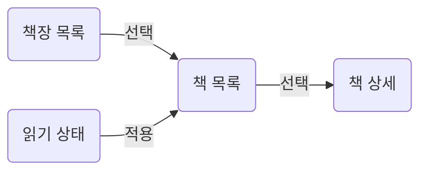

가상의 독서 목록 앱 **별책**. 책장 선택 → 읽기 상태 필터 → 책 상세 확인.
화면 흐름·결정·질문·API 계약을 한 문서에 담는 작성 예시.
등장하는 서비스·책·인물·식별자·API·결정은 모두 이 문서를 위한 가상 내용.

:::note[Example]
별책의 기능과 API는 for humanity가 제공하는 기능이 아님. 예시 API에 연결하거나 데이터를 요청하지 않음.
라이브러리의 실제 사용 계약은 [API](api.md), 부품 작성법은 [Parts](parts.md).
:::

## Overview

| Area      | Purpose                   | Reference                  |
| --------- | ------------------------- | -------------------------- |
| 책장 목록 | 읽을 책이 담긴 책장 선택  | [Shelf list](#shelf-list)   |
| 조건 설정 | 읽기 상태로 책 목록 좁힘  | [Conditions](#conditions)  |
| 책 목록   | 제목·저자·읽기 상태 비교  | [Book list](#book-list)     |
| 미결 사항 | 예시 설계의 남은 판단     | [Questions](#questions)    |

:::note[Scope]
책장 탐색과 책 상세 읽기가 예시 범위. 책 구매·회원 가입·실제 도서 검색은 다루지 않음.
:::

::part[Screen]

## Flow



책장을 선택하면 해당 책 목록 조회. 읽기 상태를 적용하면 같은 책장의 목록 갱신.
책 제목을 누르면 그 책의 상세 화면으로 이동.

## Shelf list

왼쪽 목록. 책장 이름과 책 수. 예시 책장: `주말 읽기`, `다음에 읽을 책`.

| Value       | Display       |
| ----------- | ------------- |
| `shelfId`   | 선택 식별자   |
| `name`      | 책장 이름     |
| `bookCount` | `N 권`        |

:::note[Question Q1]
처음 방문하면 첫 책장을 자동 선택할지, 책장 선택 안내를 먼저 보여줄지 미정.
:::

:::details[구현 상세 · 선택과 조회]
### Selection state

- 선택 key와 요청 path는 응답의 `shelfId` 사용 · [D1](#decisions)
- 책장 이름을 바꿔도 같은 식별자 유지
- 예시 주소: `/shelves/weekend?status=reading`

```text
GET /api/shelves/weekend/books?status=reading
```
:::

## Conditions

목록 머리의 읽기 상태 필터. 편집 중인 draft와 목록에 적용된 조건 구분.
후보는 `all`, `planned`, `reading`, `finished`. `all`은 query에서 상태 생략.

| State     | Use                      |
| --------- | ------------------------ |
| Draft     | 편집 중인 읽기 상태      |
| Applied   | 책 목록의 요청 조건      |
| Selection | 선택한 책장의 식별자     |

### Condition popover

[D2](#decisions): 적용 버튼에서만 목록 갱신. 취소하면 draft 폐기.
편집 중의 선택으로 현재 목록이 계속 바뀌는 현상 방지.

## Book list

선택한 책장의 책 목록. 제목·저자·읽기 상태 표시.
아래 책과 저자는 실제 도서 정보를 사용하지 않은 예시 데이터.

| ID         | Title                | Author | Status    |
| ---------- | -------------------- | ------ | --------- |
| `book-101` | 비 오는 골목의 지도  | 윤가람 | `reading` |
| `book-102` | 느린 우체국의 편지  | 서누리 | `planned` |

:::details[구현 상세 · 요청과 표시]
### Table contract

- path: 선택한 `shelfId`
- query: 선택 상태의 `status` · 전체 보기에서는 생략
- 제목순 표시 · 제목이 같으면 `bookId`순
- 빈 목록과 조회 오류는 별도 상태로 표시
:::

::part[Decisions]

## Decisions

| ID | Status  | Decision                        | Reason                         |
| -- | ------- | ------------------------------- | ------------------------------ |
| D1 | Decided | 이름 대신 `shelfId`로 책장 참조 | 이름 변경 후에도 링크 유지     |
| D2 | Decided | 적용 버튼에서만 조건 반영       | 편집 중인 입력과 목록 구분     |

결정에는 식별자·상태·선택 이유. 미결 사항은 [Questions](#questions)에서 추적.
이 표의 상태도 가상 앱의 설계 예시. 라이브러리 구현의 진행 상태와 무관.

## Questions

| ID | Topic     | Needs answer                          |
| -- | --------- | ------------------------------------- |
| Q1 | 초기 선택 | 첫 책장을 자동 선택할지               |
| Q2 | 완료한 책 | 별도 보관함으로 옮길지, 상태만 바꿀지 |

답이 정해지면 같은 항목에 이유를 기록. 결정과 남은 질문을 나눠 적는 방법의 예시.

::part[Structure]

## API

아래 path와 응답은 가상 계약. 실제 서버와 연결된 API가 아님.

| Endpoint                               | Caller    | Use                 |
| -------------------------------------- | --------- | ------------------- |
| `GET /api/shelves`                      | 책장 목록 | 책장 이름·건수 조회 |
| `GET /api/shelves/{shelfId}/books`       | 책 목록   | 책장의 책 조회      |
| `GET /api/books/{bookId}`               | 책 상세   | 선택한 책의 상세    |

::::details[구현 상세 · 응답 필드]
### Response fields

```json
{
    "shelfId": "weekend",
    "books": [
        {"bookId": "book-101", "title": "비 오는 골목의 지도", "author": "윤가람", "status": "reading"}
    ]
}
```

:::note[Empty result]
조건에 맞는 책이 없으면 `books: []`. 조회에 실패한 응답을 빈 목록으로 표시하지 않음.
:::
::::

## Checks

- 선택 책장과 책 목록 요청의 path 일치
- draft 편집과 적용된 조회 조건의 구분
- 목록의 로딩·빈 결과·오류 표시
- 책장 이름을 바꿔도 같은 링크 사용
- 결정한 내용과 미결 질문 구분

[Selection state](#selection-state), [Table contract](#table-contract), [Response fields](#response-fields)는 접힌 구현 상세의 직접 링크.

## Writing this example

화면 흐름은 Mermaid, 값과 계약은 표·코드, 보충 설명은 Note, 구현 상세는 Details로 작성.
소스는 이 페이지의 `blueprint.md`. 가상 내용은 자신의 프로젝트 설명으로 교체해 사용.

이 견본은 일반 Markdown 문서이며 `type`을 지정하지 않습니다.
기존 `blueprint.md` 경로는 링크 호환을 위해 유지합니다. 다른 작성 목적은 [Authoring](authoring.md)과 [Research example](research-example.md).
