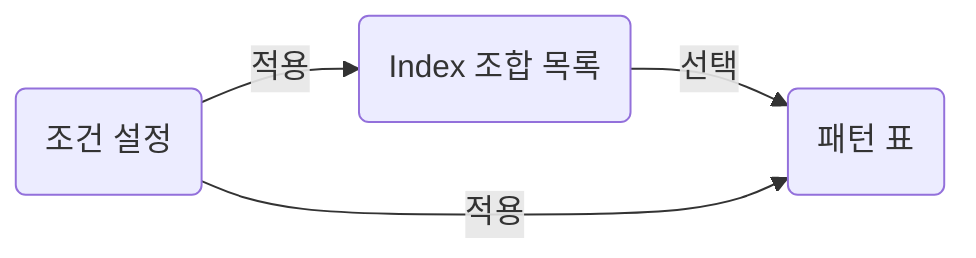

실시간 패턴 목록. Index 조합 선택 → 그 조합의 진입 예정·초기 패턴 조회.
기존 실시간 목록 blueprint를 핵심 흐름·결정·질문·API 중심으로 축약한 샘플.
제안과 미결 사항의 구분은 원본 기준. 작성 문법은 [Parts](parts.md).

## Overview

| Area         | Purpose                           | Reference                |
|--------------|-----------------------------------|--------------------------|
| 조합 목록    | 조회할 Index 조합 선택            | [Group list](#group-list) |
| 조건 설정    | 조합·패턴 조회 범위 적용          | [Conditions](#conditions) |
| 패턴 표      | 선택한 조합의 패턴 비교           | [Pattern table](#pattern-table) |
| 미결 사항    | 구현 범위와 계약의 남은 판단      | [Questions](#questions)   |

:::note[Scope]
진입 등록은 Q21 확인 전까지 보류. 조합 목록·조건·패턴 표가 현재 설계 범위.
Last Update와 표의 미등록 필드는 API 확인 대상.
:::

::part[Screen]

## Flow



조건 적용은 조합 목록과 패턴 조회에 함께 반영.
선택한 조합은 표의 요청 path와 도구 줄의 기준.

## Group list

왼쪽 목록. 조합 이름·패턴 건수·고정 여부.

| Value                | Display                |
|----------------------|------------------------|
| `indexNm`            | 조합 이름              |
| `patternCount`       | `N 건`                 |
| `isFixed`            | 고정 조합 표지         |
| `indexDisplayOrd`     | 조합 표시 순서         |

:::note[Question Q1]
최초 조합의 자동 선택은 기획 확인 대상.
고정 조합의 0건 노출과 표시 순서는 B6 확인 대상.
:::

:::details[구현 상세 · 선택과 조회]
### Selection state

- 응답의 `aIndexId`·`bIndexId`: 선택 key와 패턴 조회 path
- 주소의 `groupAIndexId`·`groupBIndexId`: 선택 상태의 계약 · D7
- 조합 이름을 문자열로 나눠 ID나 도구 줄 이름을 복원하지 않음 · B7·Q20

```text
GET /api/realtime/pattern/groups/{aIndexId}/{bIndexId}
```
:::

## Conditions

목록 머리의 조건 설정. 폼의 draft와 적용된 조건 구분.
지수·월 선택의 후보는 `indexList` 조회, 적용된 조건은 목록·표 조회.

| State       | Use                                  |
|-------------|--------------------------------------|
| Draft       | 팝오버에서 편집 중인 입력            |
| Applied     | 조합 목록·패턴 표의 요청 조건        |
| Selection   | 목록에서 선택한 조합의 식별자        |

### Condition popover

D2 제안: route 트리 안의 `UiPopover`.
기존 NiceModal의 렌더 위치에서는 nuqs의 주소 상태를 읽기 어려운 제약.
조건 편집·적용 계약과 팝오버 배치를 함께 검토.

## Pattern table

오른쪽 표. 선택한 조합의 패턴, 단위 전환, 정렬, 페이지 이동.
좁은 표에서 순번·실제 Index 조합 고정, 나머지 열은 가로 스크롤.

| Columns                  | Content                           |
|--------------------------|-----------------------------------|
| 순번·실제 Index 조합     | 목록 위치·조합 이름·상세 이동      |
| 해석·패턴 구간           | 방향·시작과 끝                    |
| 패턴 길이·진입·잔여일    | 기간과 기준일 대비 위치           |
| 반복률·재현도·Spread 차이 | 비교 지표                         |
| Action                   | Q21 답에 따라 범위 결정           |

:::details[구현 상세 · 요청과 표시]
### Table contract

- path: 선택 조합의 `aIndexId`·`bIndexId`
- query: 조건 9개와 `page`·`recordsPerPage`·`sortCd`·`columnSortTypeCd`
- `patternPeriod`: 서버 문자열 유지
- `tradingDirectionCd`·`tradingDirectionCdNm`: 해석 표시 · null과 코드 표 확인
- `patternDayCnt`·`grade`·전체 재현도·전체 Spread: B14의 누락 필드 확인
:::

::part[Decisions]

## Decisions

| ID | Status      | Proposal                               | Reason                         |
|----|-------------|----------------------------------------|--------------------------------|
| D2 | Recommended | 조건 설정에 route 안의 `UiPopover`     | 주소 상태와 편집의 같은 범위   |
| D1 | Recommended | 공통 값·select 어댑터만 공유           | 계절성 변경 범위 축소          |
| Q21 | On hold    | 진입 등록은 답 이후 구현 범위 확정     | 데모·전달 내용의 기능 범위 확인 |

결정에는 식별자·상태·선택 이유. 미결 사항은 [Questions](#questions)에서 추적.
현재는 표와 section 링크로 충분한 표현.

## Questions

| ID  | Topic                | Needs answer                          |
|-----|----------------------|---------------------------------------|
| Q1  | 초기 선택            | 첫 조합을 자동 선택할지               |
| Q21 | Action·진입 등록     | 현재 기능 범위에 포함할지             |
| B3  | Last Update          | 가격 데이터 최신일의 응답 위치        |
| B6  | 고정·순서            | 0건 고정 조합과 배열·표시 순서의 계약 |
| B14 | 표 필드              | 길이·등급·전체 지표 필드의 제공 여부   |

Q21은 진입 등록의 범위를, B3·B14는 화면에 표시할 값을 결정하는 질문.
답은 같은 항목에 근거와 함께 반영. 제안과 확정은 상태로 구분.

::part[Structure]

## API

| Endpoint                                                      | Caller                | Use                         |
|---------------------------------------------------------------|-----------------------|-----------------------------|
| `GET /api/realtime/pattern/groups`                             | 목록·표               | 조건에 맞는 조합 조회       |
| `GET /api/realtime/pattern/groups/{aIndexId}/{bIndexId}`         | 패턴 표               | 선택 조합의 패턴 조회       |
| `GET /api/realtime/pattern/indexList`                           | 조건 팝오버           | draft의 지수·월 후보        |

::::details[구현 상세 · 응답 필드]
### Response fields

| Field                   | Use                  | Pending           |
|-------------------------|----------------------|-------------------|
| `aIndexId`·`bIndexId`    | 선택 key·요청 path   | 주소 계약 D7      |
| `indexNm`               | 조합 표시 이름       | 도구 줄 B7·Q20    |
| `patternCount`          | 조합별 패턴 건수     | 0건 상태          |
| `isFixed`               | 고정 여부            | B6                |
| `indexDisplayOrd`       | 표시 순서            | B6                |

:::note[Question B3]
Last Update의 기준은 가격 데이터 최신일. 응답 위치는 확인 필요.
:::
::::

## Checks

- 선택 조합과 패턴 요청의 path 일치
- draft 편집과 적용된 조회 조건의 구분
- 목록·표의 로딩·빈 결과·오류 표시
- 좁은 표의 고정 열과 내부 가로 스크롤
- 미등록 필드와 미결 기능의 상태 구분

[Selection state](#selection-state), [Table contract](#table-contract), [Response fields](#response-fields)는 접힌 구현 상세의 직접 링크.

## Source

원본: `sk-ax-gas-pp/.ignore/blueprint/blueprint.realtime-list.html`.
문서 짜임·부품·두 독자의 읽는 순서는 같은 폴더의 `README.md`.
원본의 전체 목업·질문 카드·주석 캡처는 이 축약본의 범위 밖.

현재 `type: blueprint`는 일반 문서와 같은 페이지 표현.
전용 정보 구조와 표현은 [Roadmap](roadmap.md#blueprint)의 다음 단계.
