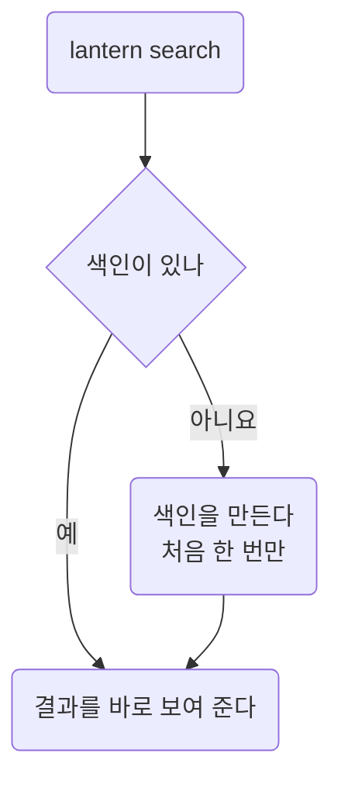

Lantern이 받는 명령을 모았다. 설치부터 검색, 실시간 보기까지 쓰는 차례대로 적었다.
설정 파일은 [Settings](settings.md), 장애 때 쓰는 순서는 [Workflow](workflow.md)에 있다.

## 한눈에

| 절 | 무엇을 답하나 |
|----|---------------|
| 01 | 어떻게 설치하고 확인하나 |
| 02 | 첫 검색은 어떻게 하나 |
| 03 | 낱말과 시간 범위는 어떻게 주나 |
| 04 | 새로 들어오는 줄은 어떻게 보나 |
| 05 | 아직 확인하지 못한 것 |


::part[시작]

## 설치

Lantern은 명령 하나로 설치한다. macOS와 Linux에서 확인됨 2026-09-30.

```sh
npm install -g lantern-cli
lantern --version
```

### 요구 사항

| 항목 | 값 |
|------|----|
| Node | 22 이상 |
| 디스크 | 색인 1GB마다 약 80MB |
| 권한 | 로그 폴더를 읽을 수 있어야 한다 |

### 설치 확인

`lantern doctor`가 색인 폴더, 권한, 글꼴을 차례로 본다. 하나라도 실패하면 이유를 한 줄로 알려 준다.

## 첫 검색

색인이 없으면 첫 검색 때 한 번만 만든다. 그다음부터는 바로 찾는다.



| 옵션 | 뜻 | 기본 |
|------|----|------|
| `--since` | 이 시각 뒤의 줄만 본다 | 24시간 전 |
| `--limit` | 보여 줄 줄 수 | 200 |
| `--color` | 찾은 낱말의 강조 색 | `#e80030` |

::part[명령]

## search

### 낱말

`lantern search "timeout"`처럼 낱말을 주면 그 낱말이 든 줄을 찾는다. 정규식은 `--regex`를 붙여 쓴다.

```sh
lantern search "timeout" --since 2h
lantern search "5[0-9]{2}" --regex --limit 50
```

### 시간 범위

`--since 2h`, `--until 2026-09-30T12:00` 꼴을 받는다. 시간대는 설정의 `timezone`을 따른다 ([Settings](settings.md#시간대)).

## tail

`lantern tail`은 새로 들어오는 줄을 계속 보여 준다. `Ctrl+C`로 멈춘다.

> 한 번에 너무 많은 줄이 들어오면 화면이 따라가지 못한다. 그럴 때는 `--filter`로 먼저 좁힌다.

::part[기록]

## 확인 안 된 것

- Windows에서 설치되는지는 확인되지 않았다.
- 색인이 10GB를 넘을 때의 검색 속도는 확인되지 않았다.
