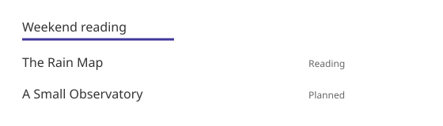

로컬 이미지와 첨부를 문서 파일 위치 기준으로 참조합니다. 같은 파일을 dev·정적 빌드에서 같은 내용 지문 URL로 제공합니다.
이미지의 설명과 출처는 일반 Markdown으로 작성하며 별도 Figure directive는 아직 없습니다.

## Relative paths

```text
docs/
├── README.md
├── images/
│   └── sample.svg
└── guide/
    └── screen.md
```

`guide/screen.md`에서:

```markdown


책장 이름과 선택 표시가 있는 가상 그림입니다.
[그림 크게 보기](../images/sample.svg)
```

아래 그림은 이 저장소의 가상 예시 자원입니다.



선택 책장을 이름과 강조선으로 구분하는 가상 그림입니다.
[그림 크게 보기](images/sample.svg)

참조식 이미지와 원시 HTML의 ``에도 같은 상대 경로 규칙을 적용합니다.
문서 폴더의 README와 하위 문서를 동일하게 처리합니다. 프로젝트만 빌드할 때도 그림은 선택한 문서 루트 안에 있어야 합니다.

## Build and dev

참조된 파일만 `dist/_fh/media/`로 복사합니다. 전체 이미지 폴더나 주변 개인 파일을 자동으로 복사하지 않습니다.
URL에는 파일 내용 지문을 포함하며 같은 내용·확장자는 같은 URL을 공유합니다. 파일을 바꾸면 URL도 바뀝니다.
상대 URL의 query·hash 접미사는 유지합니다. 파일명에 공백이 있으면 링크에서 `%20`으로 쓸 수 있습니다.

문서 폴더에서 지원하는 그림·첨부를 수정·추가하면 dev가 다시 처리하고 페이지를 갱신합니다.
연속 저장은 합치고 갱신을 하나씩 실행해 많은 문서를 수정해도 전체 렌더링이 동시에 쌓이지 않습니다.
처음 참조할 때 없던 그림을 나중에 저장한 경우도 다시 확인합니다. 출력·설치 폴더 변경은 제외합니다.
새 이미지 참조는 Markdown을 저장할 때 수집합니다. 실패한 갱신은 직전 정상 페이지와 자원 등록 목록을 유지하고 터미널에 오류를 표시합니다.

## Supported files

이미지: SVG·PNG·JPG/JPEG·GIF·WebP·AVIF.
첨부 링크: 위 이미지 형식과 PDF·CSV·TXT·ZIP. 실행 파일·프로젝트 소스·설정 파일을 자동으로 배포하지 않습니다.

없는 로컬 이미지·첨부, 루트 밖 경로와 바깥을 가리키는 symlink, 지원하지 않는 이미지 형식은 빌드 오류입니다.
외부 URL·data URL·사이트 루트 기준 절대 URL은 바꾸거나 내려받지 않습니다. 절대 URL의 파일은 작성자가 별도로 제공합니다.
Markdown 안의 CSS·JS, SVG 내부의 외부 파일과 CSS `url()` 의존성을 재귀 수집하지 않습니다. SVG는 자체로 표시 가능한 파일을 사용합니다.
