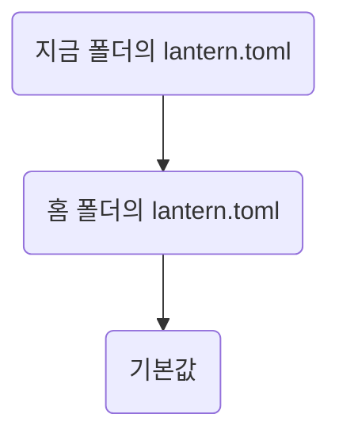

Lantern의 설정 파일 `lantern.toml`을 항목별로 적었다. 명령은 [Commands](commands.md)에 있다.

## 한눈에

| 절 | 무엇을 답하나             |
|----|---------------------------|
| 01 | 설정 파일은 어디서 읽나   |
| 02 | 색과 글꼴은 어떻게 바꾸나 |
| 03 | 시간대는 어떻게 정하나    |

::part[파일]

## 설정 파일

아래 차례로 찾고, **먼저 찾은 파일 하나만** 읽는다. 여러 파일을 합치지 않는다 (확인됨 2026-09-28).

::part[항목]

## 색과 글꼴

| 키       | 기본             | 예         |
|----------|------------------|------------|
| `accent` | `#e80030`        | `#1f6feb`  |
| `muted`  | `#6b7280`        | `#94a3b8`  |
| `font`   | `JetBrains Mono` | `D2Coding` |

### 어두운 화면

`theme = "auto"`면 시스템 설정을 따른다. `"light"`, `"dark"`로 고정할 수도 있다.

## 시간대

`timezone = "Asia/Seoul"`처럼 적는다. 비우면 시스템 시간대를 쓴다. 여름 시간이 있는 곳에서의 동작은 확인되지 않았다.
