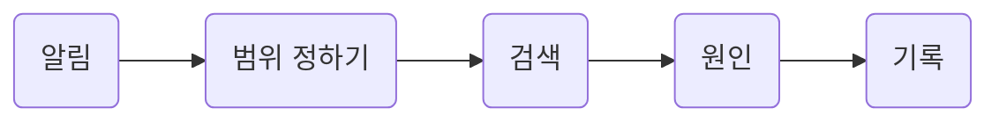

장애 알림을 받았을 때 Lantern으로 원인을 좁히는 순서다. 명령의 자세한 뜻은 [Commands](commands.md)에 있다.

## 한눈에

| 절 | 무엇을 답하나               |
|----|-----------------------------|
| 01 | 어디부터 볼지 어떻게 정하나 |
| 02 | 검색으로 어떻게 좁히나      |
| 03 | 무엇을 남기나               |

::part[찾기]

## 범위 정하기

알림이 온 시각 앞뒤 10분부터 본다. 서비스가 여럿이면 알림을 보낸 서비스 하나만 먼저 본다.

## 검색과 좁히기

### 낱말로

오류 코드가 있으면 코드로, 없으면 `error`로 시작한다.

### 시간으로

결과가 200줄을 넘으면 `--since`를 줄인다. 한 번에 반씩 줄이면 네 번 안에 원인 근처에 닿는다.

::part[기록]

## 남길 것

- 찾은 줄과 그 줄을 찾은 명령
- 원인이라고 본 이유
- 다음에 같은 알림이 오면 먼저 볼 곳
