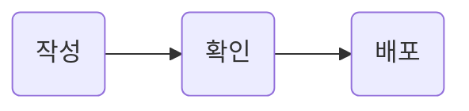

문서 한 장 = Markdown 파일 하나. frontmatter, section, part, 본문 기능의 작성 기준.

## Overview

```markdown
---
name: Guide
label: 사용 안내
group: Getting started
---

문서의 범위와 핵심.

## Overview

::part[Setup]

## Installation

### Requirements
```

문서 폴더에는 Markdown과 선택 설정 파일. 루트 `README.md`, `node_modules`, `dist`는 문서 대상에서 제외.
하위 폴더도 지원. `.mdx`는 Markdown으로 처리 · JSX 실행 미지원.

::part[Structure]

## Frontmatter

| Key     | Use                               | Required                   |
| ------- | --------------------------------- | -------------------------- |
| `name`  | 제목 · 목록 · 카드 · 첫 글자 표지 | 필수 · 비어 있지 않은 이름 |
| `label` | 짧은 문서 설명 · 카드 · 목록 툴팁 | 필수                       |
| `group` | 카드 그룹 · 문서 header 라벨      | 필수                       |
| `type`  | `document` / `blueprint`          | 기본 `document`            |

문서 이름의 첫 글자는 대소문자 구분 없이 고유. `blueprint` 전용 표현은 아직 미구현.
파일 경로는 확장자를 뺀 소문자 id로 사용. `.md`와 `.mdx`, 대소문자만 다른 경로의 id 중복 금지.
빈 경로와 예약 문자 `#`, `?`, `%`, `*`, `:`, `\`는 사용 불가. 첫 경로 `/_fh/`는 패키지 자원 전용.
`.`·`..`·`index.html` 경로 조각, 제어문자, 첫 경로 `/favicon.svg/`는 정적 출력과 충돌하므로 사용 불가.

## Sections and parts

- `##` → section 번호 `00`, `01`, `02`
- `###` → subsection 번호 `01.A`, `01.B` · section당 최대 26개
- 첫 section 앞의 글 → 문서 header
- `::part[Setup]` → 여러 section을 묶는 part · TOC 그룹
- 제목 id → GitHub 방식 · 같은 제목은 `-1`, `-2` 접미사

### Links

```markdown
[Settings](settings.md)
[Status badges](settings.md#status-badges)
```

상대 Markdown 링크 → 사이트 문서 URL. GitHub에서도 같은 파일로 이동.
외부 URL, 절대 URL, 같은 문서의 hash는 원문 유지.

::part[Content]

## Flowcharts

````markdown

````


빌드 시 격자 SVG 생성. 짧은 노드 이름, 한 단어 선 라벨 권장. 긴 라벨은 `<br>`로 분리.

## Content features

| Source                 | Result                     |
| ---------------------- | -------------------------- |
| GFM 표                 | 넓은 표의 내부 가로 스크롤 |
| 언어 지정 코드 블록    | Shiki 코드 강조            |
| 인라인 색 값 `#e80030` | swatch                     |
| 설정의 상태 문구       | status badge               |

상태 문구는 [Settings](settings.md#status-badges)에서 변경.
원시 HTML은 그대로 반영되는 작성 형식. 외부 콘텐츠의 실행·격리 환경은 제공하지 않음.

## Writing conventions

- 한 줄 한 사실
- 제목과 요약은 명사구 중심
- 경위보다 현재 계약·결정·제약
- 식별자와 값은 코드, 절차는 목록, 비교는 표
- 실제 지원 범위와 미구현 범위 구분

### Language

- 독자: 한국어 사용자 · 기본적인 영어와 개발 용어 이해 가능
- 제목·내비게이션·짧은 라벨: 익숙한 영어 표현 우선
- 본문·소개·사용법·선택 이유·오류 설명: 가능한 한 한국어
- 기술 용어·명령·코드·식별자: 원래 표기 유지 · 어색한 직역 금지
- 같은 개념은 같은 용어 사용 · 문서마다 다른 번역이나 별칭 사용 금지
- 영어 제목은 sentence case · `Status badges`, `Writing conventions` · 제품명과 API 표기는 원형 유지

`name`과 `group`은 짧은 영어 이름. `label`은 문서 설명이므로 한국어가 기본.
코드 예시도 같은 기준 적용: 제목은 `Overview`, 설명문은 한국어.

### Terms

| Term         | Meaning                                  |
| ------------ | ---------------------------------------- |
| Overview     | 문서의 범위와 핵심을 모은 첫 section     |
| Frontmatter  | 파일 맨 앞의 YAML 메타데이터             |
| Section      | `##` 제목과 자동 번호가 붙는 본문 단위   |
| Subsection   | `###` 제목 · section 안의 하위 단위      |
| Part         | `::part[...]`로 여러 section을 묶는 그룹 |
| TOC          | 현재 문서의 section·subsection 목록      |
| Status badge | 설정의 상태 문구를 강조하는 표지         |
| Swatch       | 인라인 색 값 앞에 표시하는 색 견본       |
